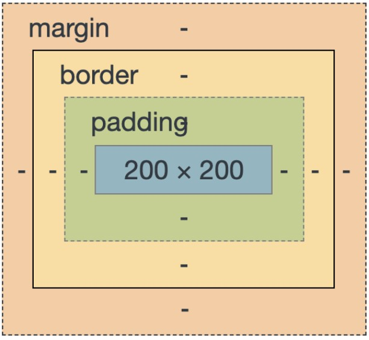
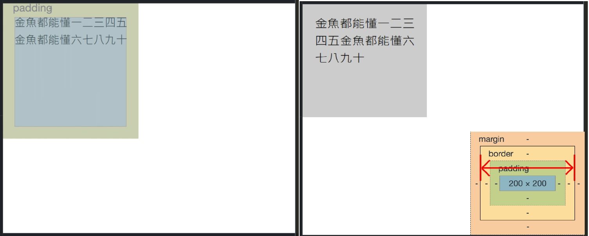
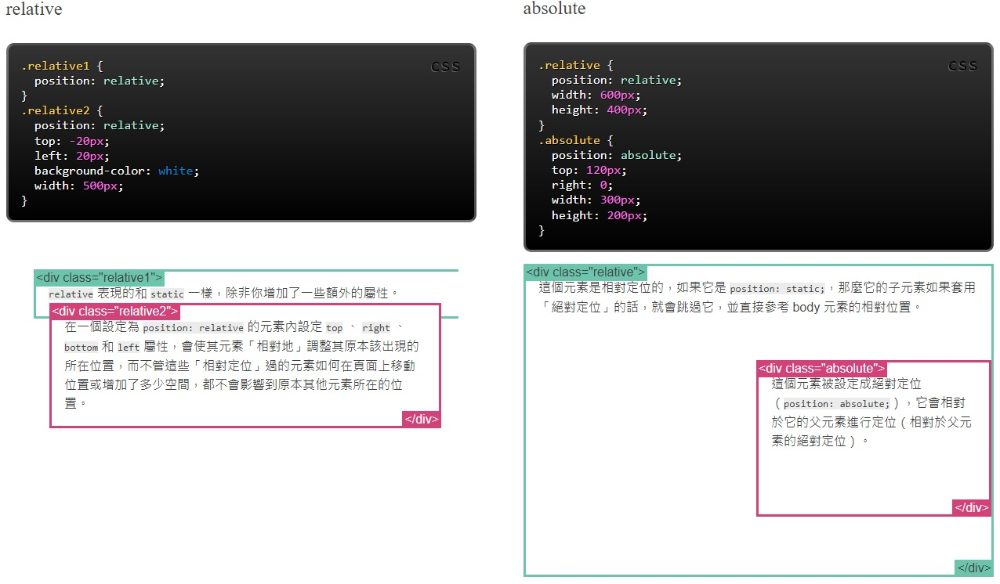
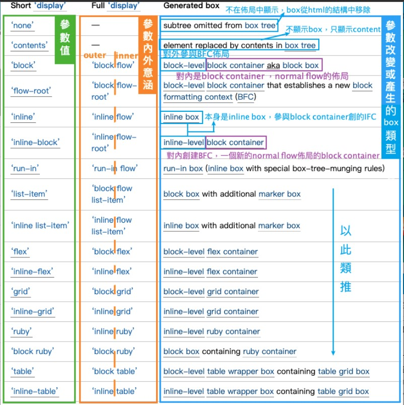
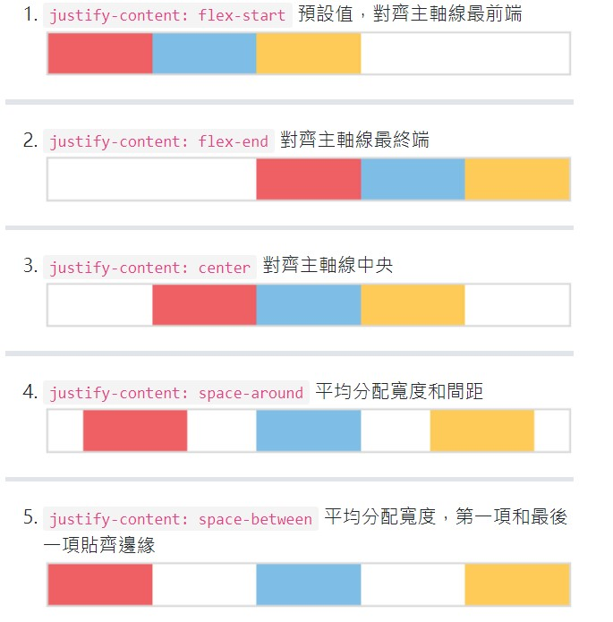
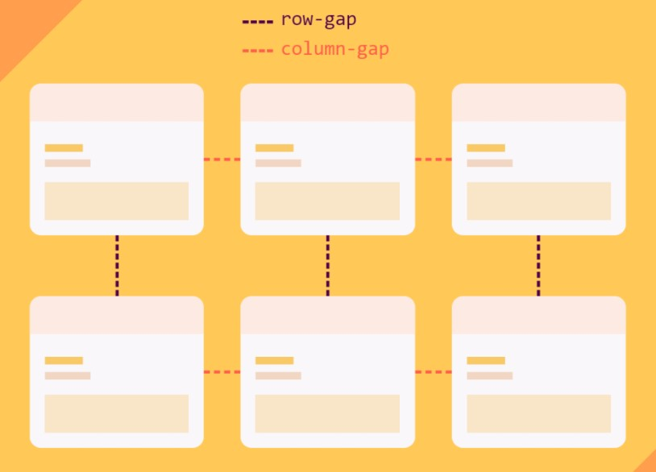

### Day1 - Pixel Art Generator
---
html相關:
* input: type="color"、"range"
* label、input、snap組合

css相關:
* padding屬性 : 內距
    ```
    padding:上 右 下 左;　
    padding:上下 左右;　
    padding:上 左右 下;　
    padding:全;
    ```

* margin屬性 : 定義一個區域（例如 DIV 或 span）的外邊界距離。俗稱外距，與常用的 padding（內距）剛好不同。
    ```
    margin:上 右 下 左;　
    margin:上下 左右;　
    margin:上 左右 下;　
    margin:全;
    ```

* box-sizing : 控制 width 與 height 作用的對象空間
    ```
    box-sizing: content-box; //(default) 寬高設定作用在內容(content)範圍
    box-sizing: border-box;  //寬高設定作用包含邊框外緣(boder)的範圍
    ```

    
    content-box效果 & border-box效果:
    

* width、height: 長、寬
    ```
    width: px
    width: %
    width: vh  //代表的是view height，也就是螢幕可視範圍高度的百分比
    width: vw  //vw表示的是view width，也就是螢幕可是範圍寬度的百分比
    width: vmin、vmax //抓取「長或寬較小/較大的那個的百分比」
    ```

* Top 、Right 、Bottom 、Left 4個 CSS 屬性是搭配 position 一起使用
    ```
    position: static;
    position: fixed;
    position: relative;
    position: absolute;
    ```

    

* display: 控制元素的佈局規則
    ```
    display: [Outer] [Inner]
    [Outer]: inline、block
    [Inner]: flow、flow layout、flow root、flex、grid
    ```

    
    

* display: flex 隨著網頁縮放去改變比例
    ```
    * flex-wrap: nowrap | wrap | wrap-reverse; //告訴它能不能換行，因為flex的預設是不換行
    * flex-direction: row | row-reverse | column | column-reverse; //(row為預設值，由左至右，從上到下)
    * flex-flow: column wrap; (同時設定flex-direction和flex-wrap)
    * justify-content: flex-start | flex-end | center | space-between | space-around | space-evenly;
    * align-item: stretch | flex-start | flex-end | center | baseline; //和jusitfy-content的用法類似，但它是用來控制「垂直對齊」的位置
    * align-content: stretch | flex-start | flex-end | center | space-around | space-between | space-evenly;
    * align-self: stretch | flex-start | flex-end | center | baseline; //和align-item的功能一樣，但它是針對「單一」對象
    * order //重新定義內元件的排列順序
    * flex  //flex-grow、flex-shink、flex-basis的縮寫
    ```
    以下只特別顯示justify-content特性差異:
    

* gap : 網隔間細，用來控制網格間的距離，網格來源包含flex、grid、muti-column。
    ```
    gap: all;
    gap: row-gap column-gap;
    ```
    


