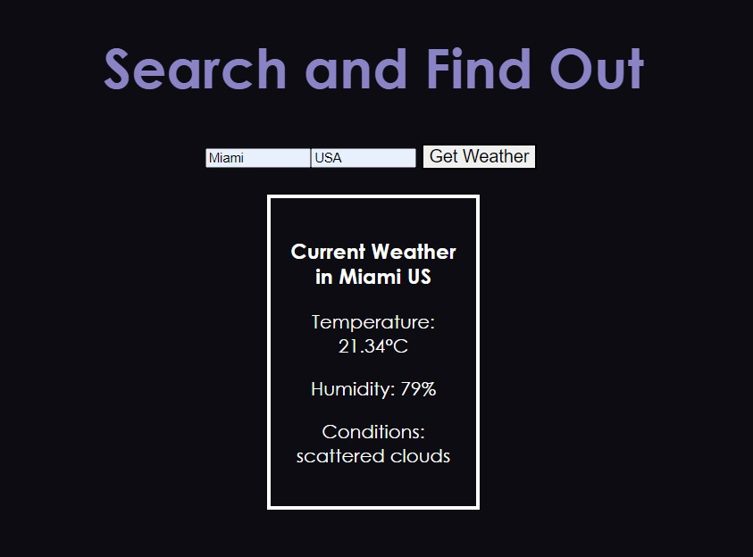

# Day3: A Simple React App - "Weather App"
## Getting Started


### How to use?
```
npm i
npm start
```



---

主要觀念:
* 在props傳遞Object
    ```
    if (temperature!==undefined){
        layout= (
        <div>
            <Weather result={{
            country: country,
            city: city,
            temperature: temperature,
            humidity: humidity,
            decription: decription,
            }}/>
        </div>
        )
    }
    ```
    
* 使用Fetch執行非同步資料撈取:
    ```
    //fetch會return 一個promise 
    const api_call = await fetch(`https://api.openweathermap.org/data/2.5/weather?q=${city},${country}&units=metric&appid=${Api_Key}`);
    // parses JSON response into native JavaScript objects
    const response = await api_call.json(); 
    ```

* 學會使用OpenWeatherMap OpenAPI:
    > https://openweathermap.org/current#geocoding


* 學會使用Meterial UI for React:
    ```
    <Dialog
        open={open}
        onClose={handleClose}
        aria-labelledby="alert-dialog-title"
        aria-describedby="alert-dialog-description"
    >
        <DialogTitle id="alert-dialog-title" style={{color: 'black'}}>
            {"Oops!! Something Wrong Happen!"}
        </DialogTitle>
        <DialogContent>
            <DialogContentText id="alert-dialog-description">
            Can not get response of OpenWeatherMap!
            Please try again!
            </DialogContentText>
        </DialogContent>
        <DialogActions>
            <Button onClick={handleClose} autoFocus>
            OK
            </Button>
        </DialogActions>
    </Dialog>
    ```