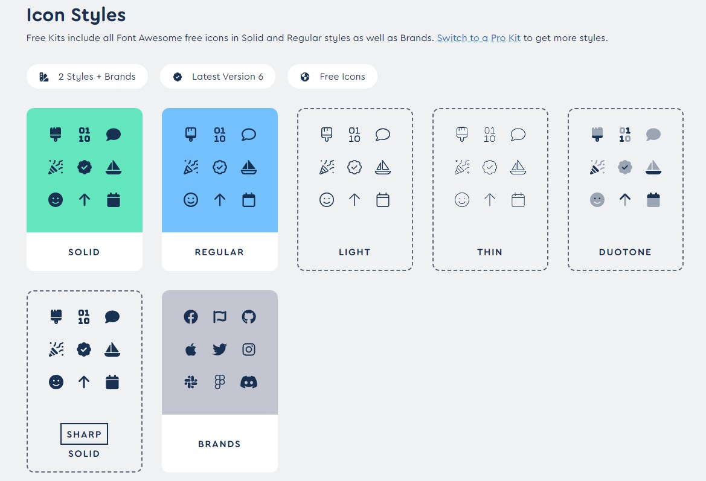
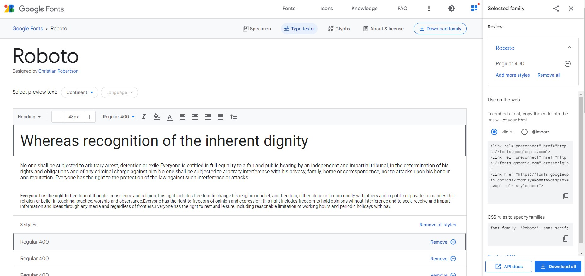
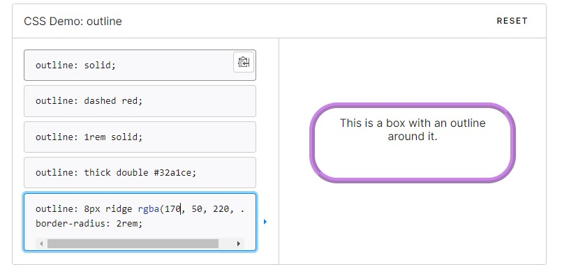
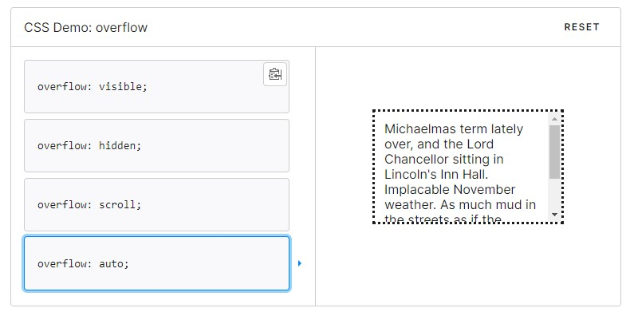
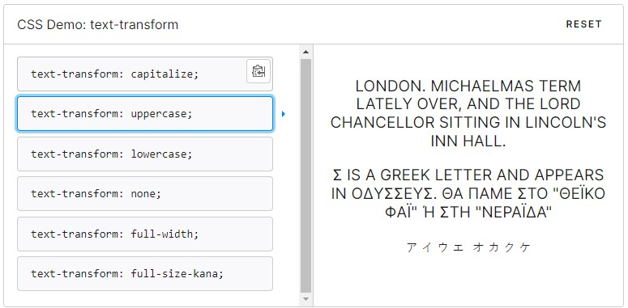

# Day4: Weather App (Advanced UI)
## How to use?

Type your file path to search bar and enjoy!


---

重點: 
* FontAweSome API: 學會使用FontAweSome icon CDN圖庫，大量藝術圖 (直接支援React、Vue SDK!!!)
    需要註冊，登入後他會給你一個你專屬的js lib。
    網址: https://fontawesome.com/
    
    使用方式:
    ```
    <i class="fa-solid fa-location-dot">
    ```


* GoogleFonts API: 學會使用GoogleFonts API導入藝術字型。
    網址: https://developers.google.com/fonts/docs/getting_started?hl=zh-tw
    


HTML特性:
* i : 斜體效果
* span: 行內容器，具體來說是一個container，但不會換行，所以如果引入span標籤但什麼都沒做，則不具有意義。
    ```
    <p>My mother has <span class="highlight">blue</span> eyes.</p>
    ```

* outline: 設置容器輪廓
    ```
    /* 样式 */
    outline: solid;

    /* 颜色 | 样式 */
    outline: #f66 dashed;

    /* 样式 | 宽度 */
    outline: inset thick;

    /* 颜色 | 样式 | 宽度 */
    outline: green solid 3px;

    /* 全局值 */
    outline: inherit;
    outline: initial;
    outline: unset;
    ```
    

* overflow: CSS簡寫屬性，其設置了元素內容溢出時所需要的行為。
    ```
    /* Keyword values */
    overflow: visible;
    overflow: hidden;
    overflow: clip;
    overflow: scroll;
    overflow: auto;
    overflow: hidden visible;

    /* Global values */
    overflow: inherit;
    overflow: initial;
    overflow: revert;
    overflow: revert-layer;
    overflow: unset;
    ```
    

* text-transform: 可用於使文本以全大寫或全小寫形式出現，或者每個單詞都大寫
    ```
    /* Keyword values */
    text-transform: none;
    text-transform: capitalize;
    text-transform: uppercase;
    text-transform: lowercase;
    text-transform: full-width;
    text-transform: full-size-kana;

    /* Global values */
    text-transform: inherit;
    text-transform: initial;
    text-transform: revert;
    text-transform: revert-layer;
    text-transform: unset;
    ```
    

* transition: 轉場動畫效果，類似ppt簡報製作換頁動畫
* font-weight: 設定文字粗細（也可以說是字體厚度）
    ```
    normal：也就是預設字體厚度，其實可以不用特別寫出來。
    bold：常用的粗體字。
    bolder：比粗體更粗一點。
    lighter：比一般字體更細。
    100~900：數字越大越厚，數字小於 500 似乎效果不明顯。
    ```

* cursor: 指定當滑鼠指標指向哪個物件時，顯示不同的游標。
    ```
    /* 關鍵字值 */
    cursor: pointer;
    cursor: auto;

    /* URL, with a keyword fallback */
    cursor: url(hand.cur), pointer;

    /* URL and coordinates, with a keyword fallback */
    cursor: url(cursor1.png) 4 12, auto;
    cursor: url(cursor2.png) 2 2, pointer;

    /* 全域值 */
    cursor: inherit;
    cursor: initial;
    cursor: unset;
    ```

* button:hover : is to change the style of a button when you move the mouse over it.


