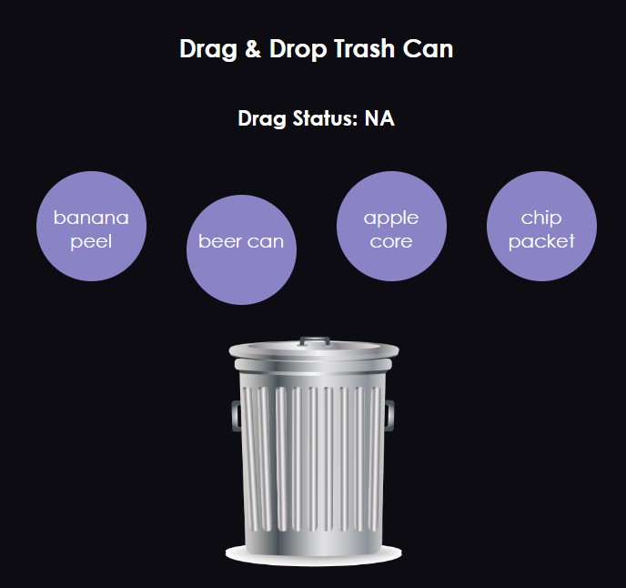

# Day7 : A Simple React App - "Drag and Drop 'trash can'"
## Getting Started

### How to use?
```
npm i
npm start
```


---
重點觀念:
* 對於HTML5 draggable 拖曳屬性的熟悉:
    1. 有一些拖曳行為是預設就是有效，像是網頁連結和圖片的拖曳，以及文字選取的拖曳（反白）。
    2. 其他元素如果要觸發拖曳就必須使用 draggable 屬性來達成。
    3. 拖曳事件基本如下:
        ```
        在拖動目標上觸發事件(源元素) :
        * ondragstart - 用戶開始拖動元素時觸發
        * ondrag - 元素正在拖動時觸發
        * ondragend - 用戶完成元素拖動後觸發

        釋放目標時觸發的事件:
        * ondragenter - 當被鼠標拖動的對象進入其容器範圍內時觸發此事件
        * ondragover - 當某被拖動的對像在另一對象容器範圍內拖動時觸發此事件
        * ondragleave - 當被鼠標拖動的對象離開其容器範圍內時觸發此事件
        * ondrop - 在一個拖動過程中，釋放鼠標鍵時觸發此事件
        ```
    4. 事件物件可以使用event裡面的 dataTransfer 物件來賦予被拖放物件想要挾帶的資料，使用方式如下：
        ```
        event.dataTransfer.setData(format, data); 
        event.dataTransfer.getData(format); 
        ```
    5. 實際範例:
        ```
        <!DOCTYPE HTML>
        <html>
        <head>
        <meta charset="utf-8">
        <title>菜鸟教程(runoob.com)</title>
        <style>
        #droptarget {
            float: left; 
            width: 200px; 
            height: 35px;
            margin: 55px;
            margin-top: 155px;
            padding: 10px;
            border: 1px solid #aaaaaa;
        }
        </style>
        </head>
        <body>

        <p ondragstart="dragStart(event)" draggable="true" id="dragtarget">把我拖动到矩形框中！</p>
        <div id="droptarget" ondrop="drop(event)" ondragover="allowDrop(event)"></div>
        <p id="demo"></p>
        <script>
            function dragStart(event) {
                event.dataTransfer.setData("Text", event.target.id);
            }
            function allowDrop(event) {
                event.preventDefault();
                document.getElementById("demo").innerHTML = " p 元素在放置目标上";
                event.target.style.border = "4px dotted green";
            }
            function drop(event) {
                event.preventDefault();
                var data = event.dataTransfer.getData("Text");
                event.target.appendChild(document.getElementById(data));
                document.getElementById("demo").innerHTML = " p 元素被拖动";
            }
        </script>

        </body>
        </html>
        ```
