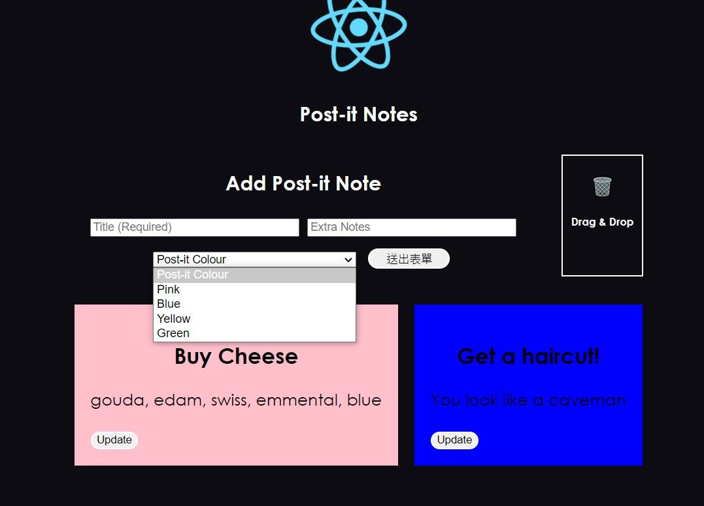

## Day8 : A Simple React App - "Post-it Note"
## Getting Started

### How to use?
```
npm i
npm start
```


---
重點觀念:
* React Form的操作熟悉
* useCallback與useMemo的概念理解: 
    1. 利用useMemo限制頁面只有在指定的state變更的時候才做畫面重新渲染
    2. 利用useCallback限制自訂Func只有在state改變的時候才重新建構

* memo概念: 如果父元件刷新，但此元件用到的props沒有變，則不渲染此元件。