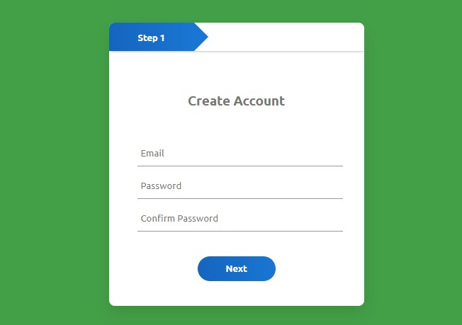

# Day9 : Multi Step Form 
## How to use?

Type your file path to search bar and enjoy!


---

重點: 
* 在JS中直接對onClick操作
  ```
  var next1 = document.getElementById("next1");
  var progress = document.getElementById("progress");
  next1.onclick = function(){
    progress.style.width = "240px";  
  }
  ```

* fonts.googleapis.com的使用:
  ```
  @import url('https://fonts.googleapis.com/css2?family=Ubuntu:wght@300;400;500;700&display=swap');
  ```

CSS:
1. text-align => 文字框位置
2. margin-bottom => 元件底部邊距
3. outline: none => 元件去邊
4. ::after 偽元素 => 它並不是真正網頁裡的元素，但行為與表現又和真正網頁元素一樣，也可以對其使用 CSS 操控。
    在 W3C 的定義裡總共有五個偽元素 ( 其他仍在測試階段 )，分別是::before、::after、::first-line、::first-letter和::selection，為了和偽類區分，偽元素使用兩個冒號「::」開頭，而偽類使用一個冒號「:」開頭 ( 像是 :hover、:target...等 )。
    ```
    div::after{
        content:"我是 after";
        color:red;
    }
    ```