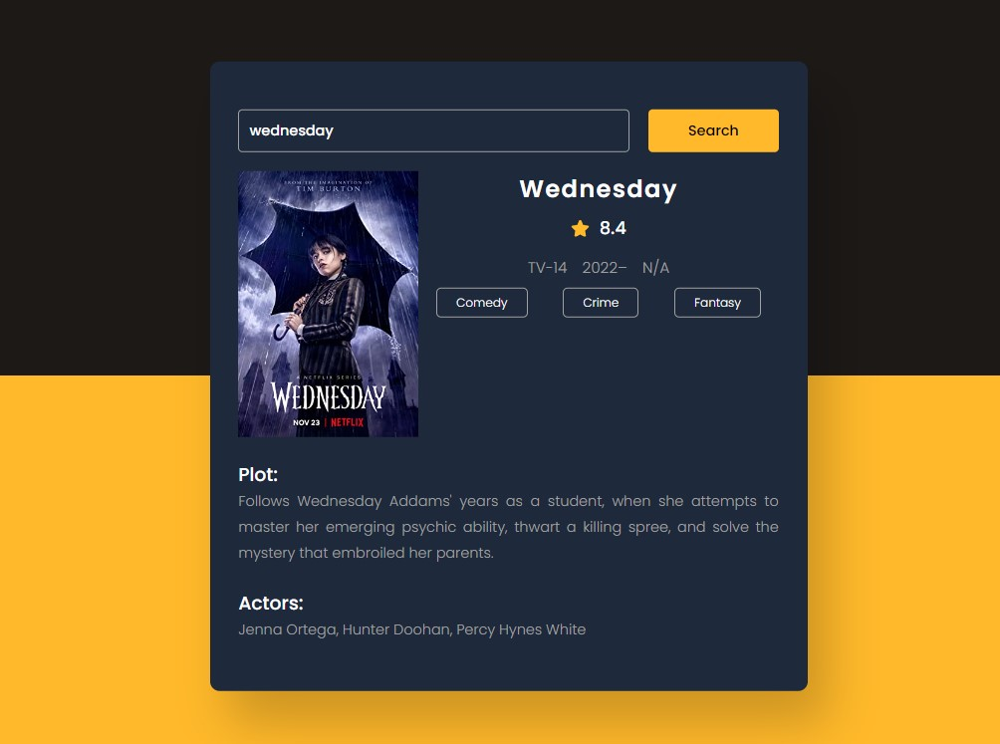
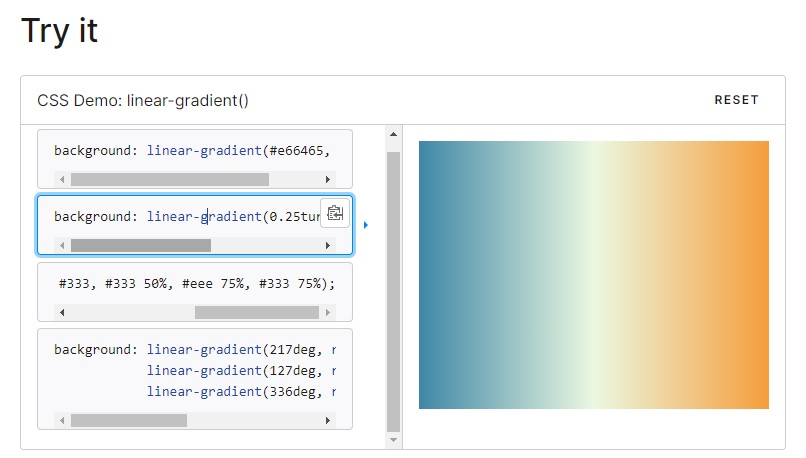
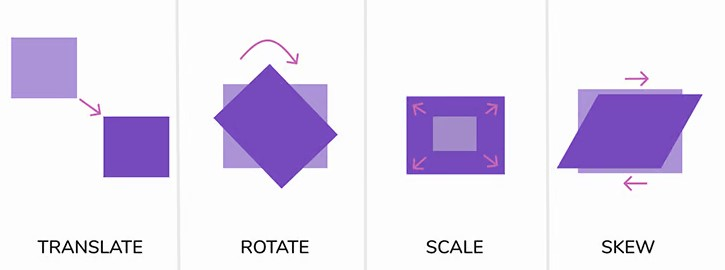
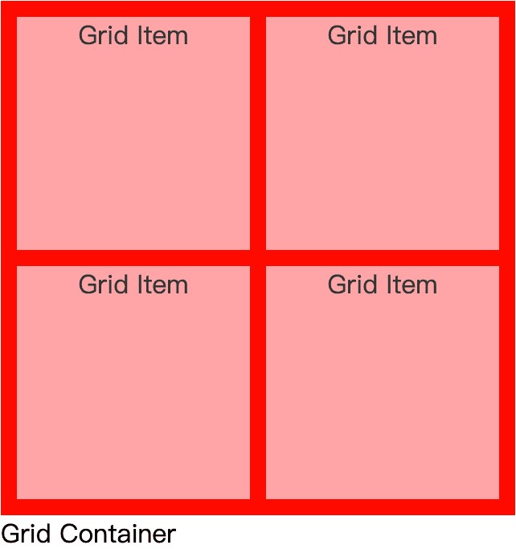
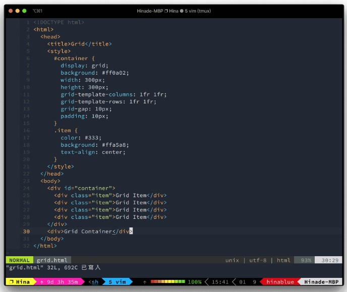
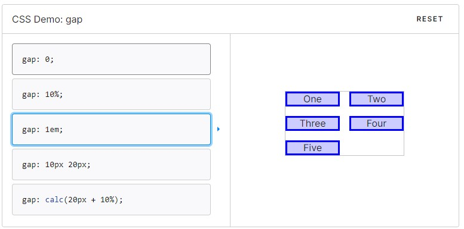

# Day10 : Movie Guide App With Javascript
## How to use?

Type your file path to search bar and enjoy!


---

重點: 
* OMDb API: 是一個電影資訊的API，要申請才能使用。
* 使用join將資料加入html介面:
    ```
    ("Genre":"Action, Adventure, Comedy")
    <div>${data.Genre.split(",").join("</div><div>")}</div>
    ```


CSS:
* linear-gradient: 是一個CSS功能，能利用兩種或多種顏色繪製版面。
    ```
    linear-gradient(45deg, blue, red);

    linear-gradient(to left top, blue, red);

    linear-gradient(0deg, blue, green 40%, red);

    linear-gradient(.25turn, red, 10%, blue);

    linear-gradient(45deg, red 0 50%, blue 50% 100%);
    ```
    

* transform: 用來翻轉區塊 (只適用於區塊(block)元件，不適用於inline元件)
    ```
    translate(平移) : 比如說 translate(50px, 20px)，就是往右移50px 往下移 20px。
    scale(縮放) : scaleX(1.5) 的意思為寬度變為 1.5 倍。
    rotate(旋轉) : rotateX(45deg) 意思就是以 X 軸為軸心，往上翻 45 度。
    skew(歪斜) : 讓元素以 X 軸或 Y 軸為基準歪斜。
    ```
    


* display: Grid
    在整個網格佈局的概念裡面，最外面的東西叫做容器（ Grid Container ），然後這個容器裡面所包含的物件，叫做項目（ Grid Item ），基本的組成大概會類似這樣:
    
    紅色的區塊，是屬於 容器 的部分，而中間粉紅色的區塊，則是屬於 項目 的部分。而他的 HTML 的內容很簡單，就是定義出四個區塊而已。為了要讓畫面上比較容易區分，所以我在區塊中間加上了 10px 的間隔，容器本身也給出了 10px 的留白填色，方便辨識。
    

    基本定義上我們有兩個:
    * grid-template-columns 定義容器有多少欄
    * grid-template-rows 定義容器有多少列

    所以如果要做一個 3x4 的容器，那麼我們可以這樣寫:
    ```
    #container {
        display: grid;
        grid-template-columns: 100px 100px 100px;
        grid-template-rows: 100px 100px 100px 100px;
    }
    ```
    > 特別注意，當一個 DOM 被定義為 grid 時，其內部的子節點會自動被定義為網格項目。而當被定義為網格項目時，他就是屬於網格層級的元件（ grid-level boxes ），而並非原有的區塊層級元件（ block-level boxes ）。

    > 原本的行內層級，會被轉譯為網格層級，例如 display: inline-block, display: table-cell，會被轉譯為 display: block 的網格層級元件。
    而以下設定會失效：float, vertical-align, column-*

    另外，這邊還提供了一個函數 repeat()，讓你可以不用重複寫一樣的設定，例如以現今流行的 12 欄位佈局來說，就這樣設定就好了:
    ```
    #container {
        display: grid;
        grid-template-columns: repeat(12, 1fr);
    }
    ```
    而這個 repeat() 函數還有兩個特殊關鍵字:
    * repeat(auto-fill, 100px) 利用 100px 的尺寸，自動填滿容器。
    * repeat(auto-fit, 100px) 利用 100px 的尺寸，僅設定所擁有的欄或是列。
    
    https://blog.hinablue.me/css-grid-layout/

* gap : 用来设置网格行与列之间的间隙
    ```
    gap: 20px 10px;
    gap: 1em 0.5em;
    gap: 3vmin 2vmax;
    gap: 0.5cm 2mm;
    ```
    

* cursor: 改變滑鼠指標
    https://developer.mozilla.org/zh-TW/docs/Web/CSS/cursor 

* text-align : 用於文字的水平對齊，基本上僅需指定一個值，其作用的對象是物件內的文字，例如我對p設定text-align，那麼p的文字內容就會在該區塊內對齊你所設定的方向。
    ```
    left (對齊左側)
    center (置中)
    right (對齊右側)
    justify (左右對齊)
    inherit
    initial
    ```

* line-height : 作用是設定文字的行高
* @media 查询: 使用 @media 查询，你可以针对不同的媒体类型定义不同的样式。
```
如果文档宽度小于 300 像素则修改背景颜色(background-color):
@media screen and (max-width: 300px) {
    body {
        background-color:lightblue;
    }
}
```