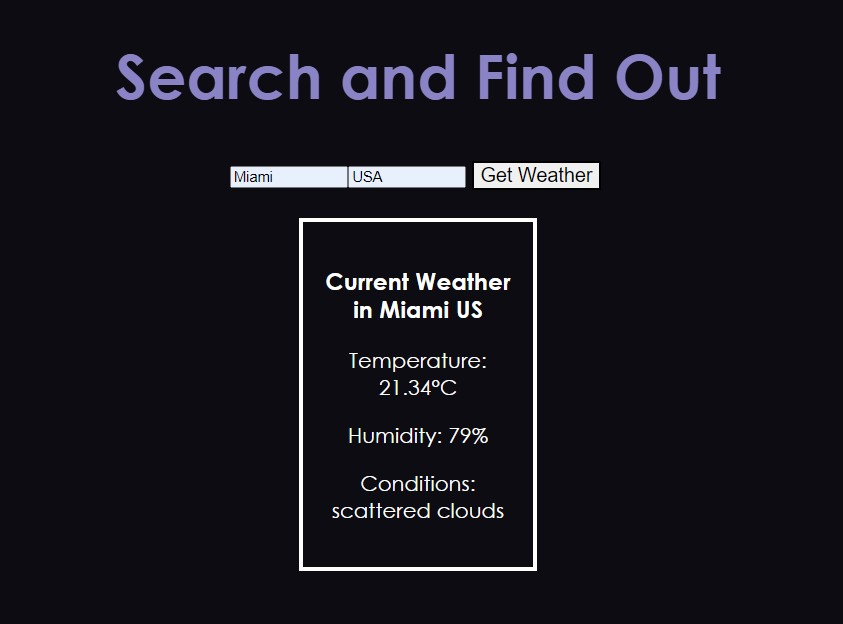

## Day1 : Pixel Art Generator
Html、JS、CSS

[GO>>](./Day01Practice)

關鍵重點:

html相關:
* input: type="color"、"range"
* label、input、snap組合

JS相關:
* input輸入取值採用"input"事件 (addListener("input",()=>{}))
* document.querySelectorAll(".classname"); 可以取得所有該classname的元素
* element.classList.add("gridCol"); //為element添加 classname
* container.innerHTML=""; //清空container內容
* container.appendChild(element); //將element加入container
* window.onload=()=>{}方法用於在網頁加載完成後立刻執行的操作
* element.style.attribute  為element添加style屬性 (css屬性) ex: col.style.backgroundColor = xxx ;  

css相關:
* padding屬性 : 內距
* margin屬性 : 定義一個區域（例如 DIV 或 span）的外邊界距離。俗稱外距，與常用的 padding（內距）剛好不同。
* box-sizing : 控制 width 與 height 作用的對象空間
* width、height: 長、寬
* Top 、Right 、Bottom 、Left 4個 CSS 屬性是搭配 position 一起使用
* display: 控制元素的佈局規則
* display: flex 隨著網頁縮放去改變比例
* gap : 網隔間細，用來控制網格間的距離，網格來源包含flex、grid、muti-column。
* keyframes CSS3動畫圖像

Reference: [https://youtu.be/DfDPJqD3FjI](https://youtu.be/DfDPJqD3FjI)

---
## Day2 : A Simple React App - "Thought Log"
Reactjs

[GO>>](./Day02Practice/thought_log)

關鍵重點:

主要觀念:
* React Form Component的邏輯操作
* React Function Component的邏輯操作
* 透過父元件整合map功能取得index一並傳入children，就不用煩惱指定對象是誰
* 善用 event.preventDefault() 防止瀏覽器執行form submit時因預設功能而跳轉或刷新頁面。

HTML特性:
* Img Alt: 圖片失效的時候，Alt替代文字可以描述圖像的內容
* Input placeholder: 該屬性可在文字框中顯示提示訊息，可用於以下input的類型：text, search, url, telephone, email 以及 password。

Reference: [https://youtu.be/jU9qjzDs6No](https://youtu.be/jU9qjzDs6No)

---
## Day3 : A Simple React App - "Weather App"
Reactjs、OpenWeatherMap OpenAPI

[GO>>](./Day03Practice/weather_app)

關鍵重點:
* 在props傳遞Object
* 使用Fetch執行非同步資料撈取:
* 學會使用OpenWeatherMap OpenAPI:
* 學會使用Meterial UI for React:

Reference: [https://youtu.be/215nd3qWnQg](https://youtu.be/215nd3qWnQg)

---
## Day4 : Weather App (Advance UI)
Html、JS、CSS

[GO>>](./Day04Practice)

關鍵重點:
* FontAweSome API: 學會使用FontAweSome icon CDN圖庫，大量藝術圖 (直接支援React、Vue SDK!!!)
    需要註冊，登入後他會給你一個你專屬的js lib。
    網址: https://fontawesome.com/

* GoogleFonts API: 學會使用GoogleFonts API導入藝術字型。
    網址: https://developers.google.com/fonts/docs/getting_started?hl=zh-tw

HTML&&CSS特性:
* i : 斜體效果
* span: 行內容器，具體來說是一個container，但不會換行，所以如果引入span標籤但什麼都沒做，則不具有意義。
* outline: 設置容器輪廓
* overflow: CSS簡寫屬性，其設置了元素內容溢出時所需要的行為。
* text-transform: 可用於使文本以全大寫或全小寫形式出現，或者每個單詞都大寫
* transition: 轉場動畫效果，類似ppt簡報製作換頁動畫
* font-weight: 設定文字粗細（也可以說是字體厚度）
* cursor: 指定當滑鼠指標指向哪個物件時，顯示不同的游標。
* button:hover : is to change the style of a button when you move the mouse over it.

Reference: [https://youtu.be/iILFBGm_I9M](https://youtu.be/iILFBGm_I9M)

---
## Day5 : A Simple React App - "Random Person Generator"
Reactjs

[GO>>](./Day05Practice/personrandom)

關鍵重點:
1. RandomUser API : 使用API取得模擬的用戶資料，藉此可以用來測試一個假的使用者。
2. React中嘗試直接使用state儲存一個JSX的List，JSX特性是如果是List會直接整個渲染。
3. AbortController: 利用此controller控制fetch擷取API的時間
4. 使用display:flex排版

Reference: [https://youtu.be/DYByXUDn44Y](https://youtu.be/DYByXUDn44Y)

---
## Day6 : A Simple React App - "Random Holiday Destination"
Reactjs

當前發現Google Map API現在要綁信用卡，小的我沒錢沒信用卡，只好先擱著

Reference: [https://youtu.be/m2FOI4L5kls](https://youtu.be/m2FOI4L5kls)

---
## Day7 : A Simple React App - "Drag and Drop 'trash can'"
Reactjs

[GO>>](./Day07Practice/drag_drop_trash)

重點觀念:
* 對於HTML5 draggable 拖曳屬性的熟悉

Reference: [https://www.youtube.com/watch?v=B4C23Dh6DMc&t=1s](https://www.youtube.com/watch?v=B4C23Dh6DMc&t=1s)

---
## Day8 : A Simple React App - ""
Reactjs

Reference: [https://youtu.be/5EULHcqDfF4s](https://youtu.be/5EULHcqDfF4)
